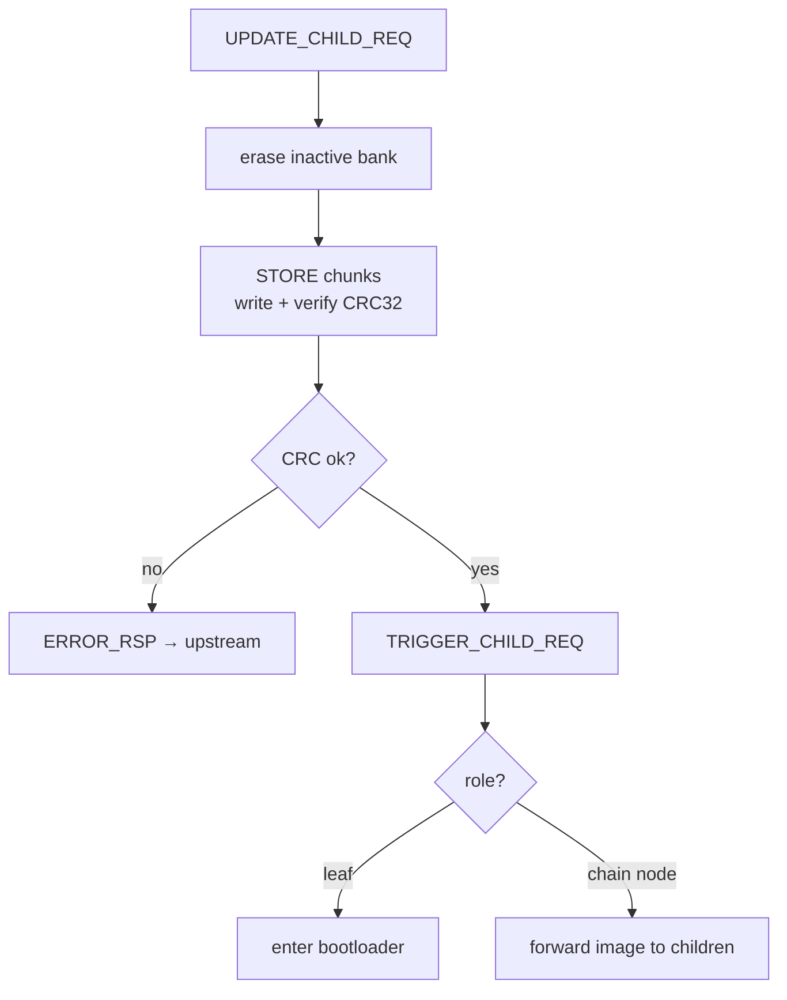

# embedded-ota

[](https://github.com/Daniel081615/embedded-ota/actions/workflows/ci.yml)


**English** | [繁體中文](README.zh-TW.md)

A portable, OS-agnostic **dual-bank, store-and-trigger OTA core** for bare-metal
MCU firmware. Pure C11, no dynamic memory, no floating point, no recursion — the
hardware is abstracted entirely behind injected function-pointer vtables, so the
same source runs on any MCU (and on a PC, see [`examples/host_sim`](examples/host_sim)).

It handles the **receive / verify / forward** side of a firmware update:
a node receives an image over any transport, stages it into the inactive flash
bank, verifies CRC, and on trigger either jumps to a bootloader (leaf node) or
relays the image to downstream children (chain node). The bootloader that does
the actual A/B swap on next boot is platform-specific and out of scope here; the
two sides agree only on the shared `fw_info.h` flash layout.

> Extracted from a production firmware mono-repo (NDHU dormitory smart-metering
> system: a Gateway → Concentrator → RoomNode chain on Nuvoton NUC1261 / Cortex-M0,
> built with Keil armclang and cross-checked under arm-gcc). This repo is the
> portable core only — none of the application/business code.

## How it works

A chain of nodes — each running this **same** core, distinguished only by an
injected role — relays a firmware image downstream until a leaf hands it to its
bootloader:


Inside every node the receive path is **store-and-trigger**: store + verify
first, then a separate trigger decides forward-or-boot. The scheduler is
identical for every role; only the injected `TriggerProxy` differs.



## Why it's portable

Everything platform-specific is injected as a vtable. The core never includes an
MCU header, never touches a register, never blocks, and never calls an OS
primitive directly:

| You implement | Interface | Purpose |
|---|---|---|
| Flash driver | `IFmcDriver_t` | erase / write / read / CRC / jump / active-bank |
| Millisecond tick | `IOtaSys_t` | timeouts (wrap-safe unsigned diff) |
| Transport send/recv | `IOtaNet_t` | send up/down, trigger forward-or-boot |
| WDT feed / reset | `IOtaEntrySys_t` | enter bootloader, confirm health, boot-time validate |
| (chain only) frame TX | `IOtaFwdTx_t` + profile | drive downstream children |

See [docs/injection-points.md](docs/injection-points.md) for the field-by-field contract.

## Quick start (runs on your PC)

```sh
make -C examples/host_sim run
```

This injects RAM-backed mock drivers and drives a leaf node through a full
update — `UPDATE → STORE×N → CRC verify → TRIGGER` — proving the core builds and
runs with zero hardware:

```
== embedded-ota host_sim ==
firmware: 256 bytes, crc=0xD48DDFE9
-> UPDATE_CHILD_REQ
-> STORE chunks
-> TRIGGER_CHILD_REQ
    TriggerProxy: bank=1 payload=256 crc=0xD48DDFE9 ver=1  (leaf -> would enter bootloader)
PASS: 256-byte firmware stored, CRC verified, trigger fired.
```

### ⚠️ Build requirement: `-fshort-enums`

`fw_info.h` guards the on-flash layout with `_Static_assert(sizeof(FW_Info_t)==8 ...)`,
which only holds when enums are 1 byte. **Compile every consumer with
`-fshort-enums`** (armclang: `--enum_is_int` off / default short). Without it the
build fails on the static assert — by design, so a layout mismatch can never
silently corrupt flash on the device.

## Files

```
ota_flash_port.h   flash driver vtable (IFmcDriver_t) + geometry constants
fw_info.h          on-flash FW_Info / Bank_MetaInfo layout + enums (shared with bootloader)
ota_protocol.h     wire encoders (UPDATE_META 20B, chunk offset 4B)
flash_service.{c,h}  bank / meta / firmware staging via the injected flash driver
ota_scheduler.{c,h}  receive FSM (store-and-trigger), role-parameterized
ota_forwarder.{c,h}  forward FSM (upstream burns downstream children) — optional
ota_entry_core.{c,h} enter-bootloader / confirm-health / boot-time validate
```

## Documentation

- [docs/architecture.md](docs/architecture.md) — module responsibilities, dependency graph, design rules
- [docs/injection-points.md](docs/injection-points.md) — the five vtables, field by field
- [docs/wire-protocol.md](docs/wire-protocol.md) — OTA commands, UPDATE_META / chunk encoding, fw_info layout
- [docs/porting-guide.md](docs/porting-guide.md) — decision tree, what to adapt, hard-won pitfalls

## Constraints

Pure C11 · no `malloc`/`free` · no recursion · no floating point · ISRs only set
flags / fill buffers (FSM advances in the main loop). Designed to stay portable
to an RTOS: each module is an actor with caller-held context, no ordering
assumptions, OS primitives only through the injected interfaces.

## License

MIT — see [LICENSE](LICENSE).
